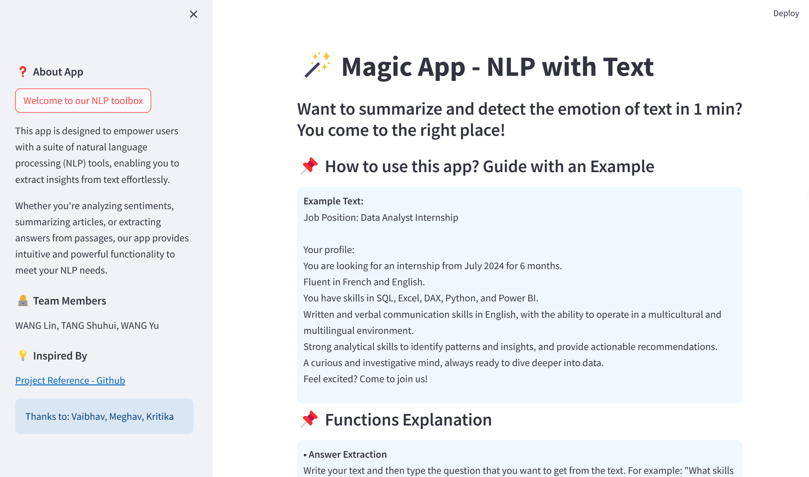
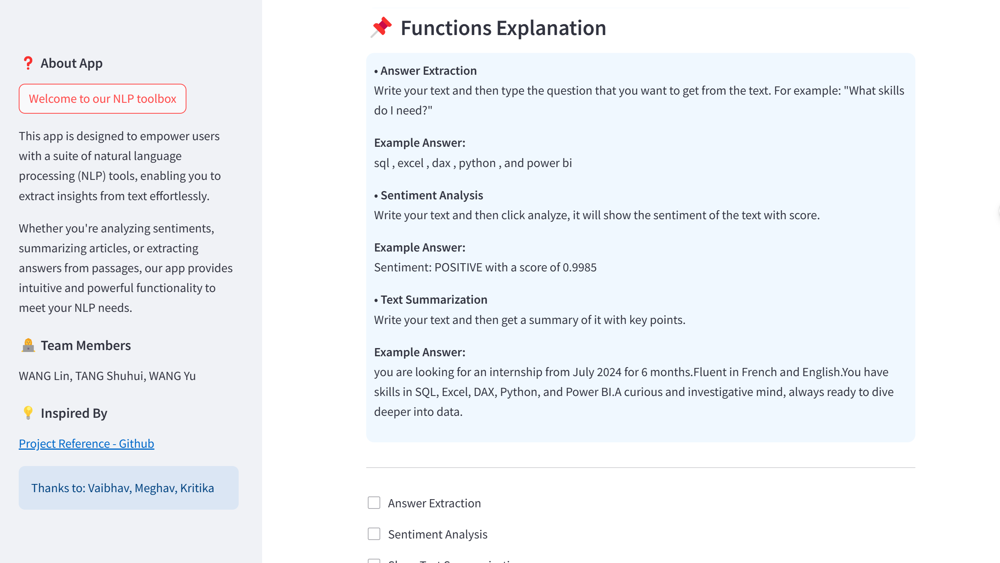
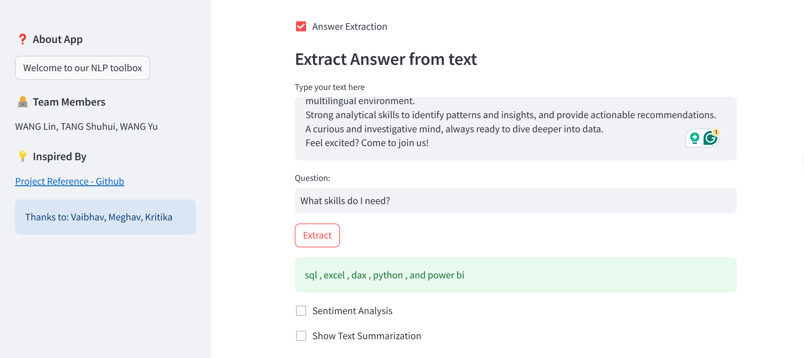
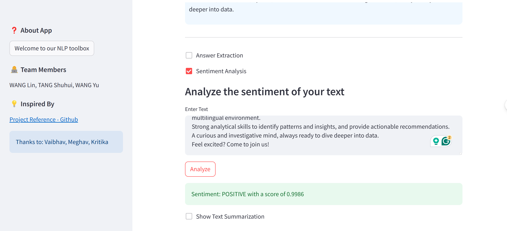
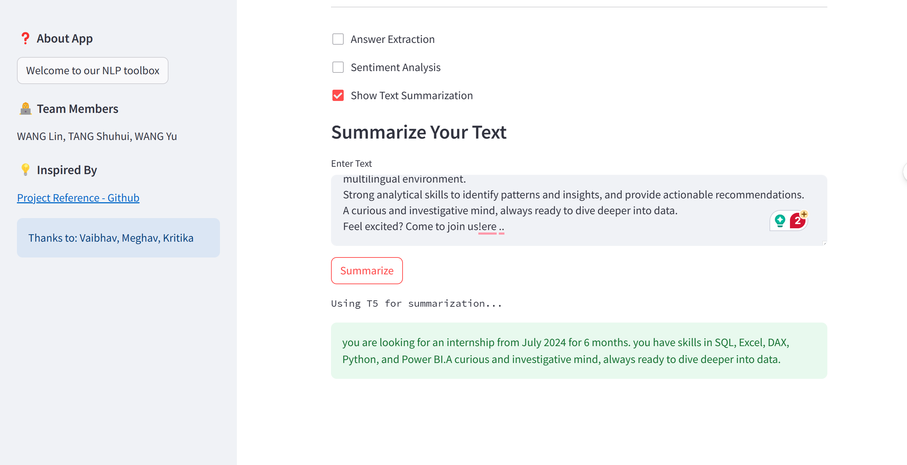

## About the App
This app is designed to empower users with a suite of natural language processing (NLP) tools, enabling you to extract insights from text effortlessly.

Whether you're analyzing sentiments, summarizing articles, or extracting answers from passages, our app provides intuitive and powerful functionality to meet your NLP needs.

---

# Results and App snapshots
• App Usage Guidance

• Expected Result with Example Text
1. Answer Extraction

---
2. Sentiment Analysis

---
3. Text Summarization

